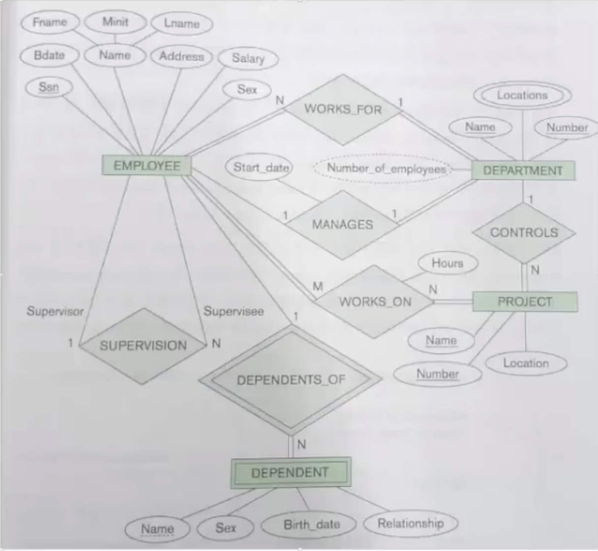

### 세번째 : 논리적 설계
ERD의 결과를 직접 SQL로 바꾸기는 어렵다.  
관계 데이터 모델로 변경.

입력 : ERD  
출력 : 관계 데이터 모델(논리 스키마)

간단한 규칙 1번 : 개체 -> 테이블  
기본적으로 ERD의 개체는 R모델에서 테이블(릴레이션)이 됩니다.

사원 (ID, ...)  
부서 (ID, ...)  
가족 (이름, ...)  
프로젝트(PID, ...)  
 
##### 관계
 관계를 맺는 개체(테이블)
 
사원 -- 1 -- 관리(시작일) == 1 == 부서

### 1:1 관계
   관계를 표현하기 위해 ____외래키(Foreign Key)____ 를 사용.  
   테이블이 다른 테이블의 키 속성을 가지면 외래키(관계표현).
   
   1. 관계를 맺는 테이블에 외래키를 추가.
   2. 관계의 속성도 테이블의 속성으로 추가.
   
   ~~~
   사원 -- 1 -- 관리(시작일) == 1 == 부서
   사원(ID, ...)
   부서(ID, ... , 부장ID, 부서시작일)
   ~~~

### 1:N 관계
   ~~~
   사원 == N == 일한다(배치날짜) == 1 == 부서
   사원(ID, ..., 부서ID, 배치날짜)
   부서(ID, ..., 부장ID, 부서시작일)
   ~~~
   
### M:N 관계
M:N 관계를 해소하기 위해 새로운 테이블생성.  
새로운 테이블의 기본키는 ____두 테이블의 외래키의 복합키____ 입니다.
~~~
사원 == N == 관리한다(시작일) == N == 프로잭트

부서(ID, ...,부장ID, 부서시작일)
부서_프로젝트관리(ID, PID, 시작일)
프로젝트(PID, ...) 
~~~

### 약개체
사원의 EID와 부양가족의 이름을 합쳐서 기본키
약개체와의 관계를 식별관계 라고 함  
 ((EID + 부양가족(이름))
~~~
사원 -- 1 -- 부양한다(관계) == N == 부양가족
사원(EID, ...)
부양가족 ((EID, 이름)), 성병, 생일)
~~~

### 참조 무결성 제약조건
외래키의 값을 제한하는 제약조건

1. ___외래키는 참조하는 테이블의 기본키를 가져옴___
2. ___반드시 NULL이거나___
3. ___부모 테이블에 존재하는 값이어야 함.___

